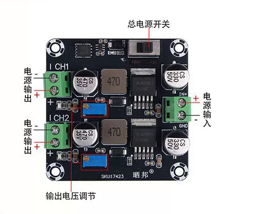
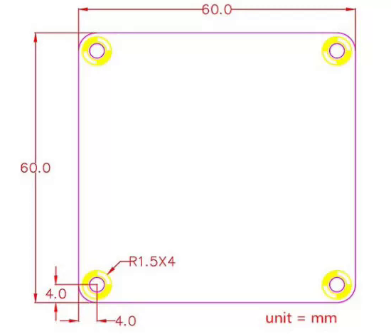

# SKU:17423 接线与调压

| 位置 | 功能 |
|---|---|
| 右侧绿端子 | 公共输入，`IN+` / `GND` |
| 左上绿端子 | CH1 输出，按板上 `+` / `-` |
| 左下绿端子 | CH2 输出，按板上 `+` / `-` |
| 上方滑动开关 | 总电源 |
| 两路蓝色电位器 | 对应通道调压；顺时针升高 |

首次：不接负载 → 电位器先逆时针多圈再顺时针调到目标电压 → 断电接负载。刚开始转电位器电压不变，通常还没进有效区间。

60×60 mm，孔距边 4 mm，孔径约 Ø3 mm，高 16.5 mm。大电流用足够线径。两路同时带载时按输入总功率核算。
