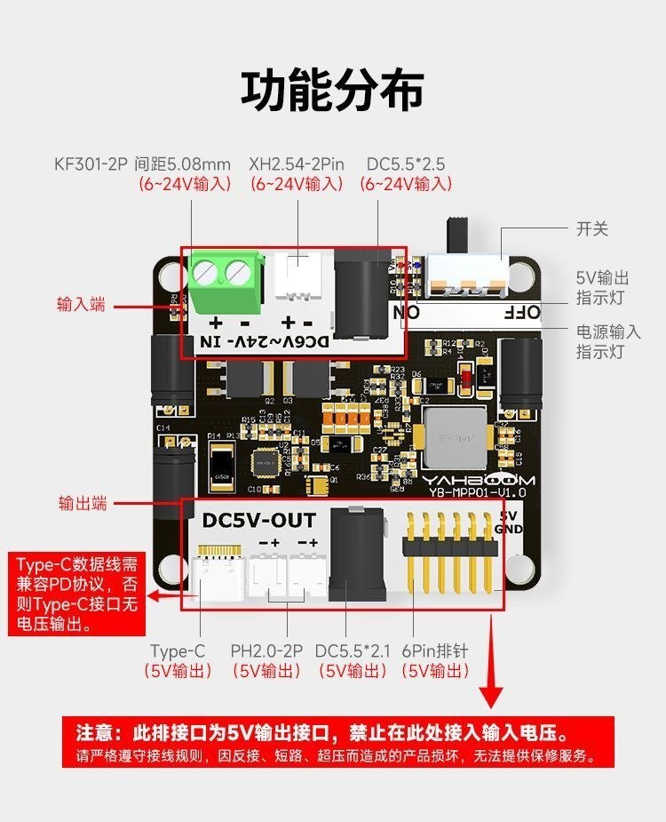
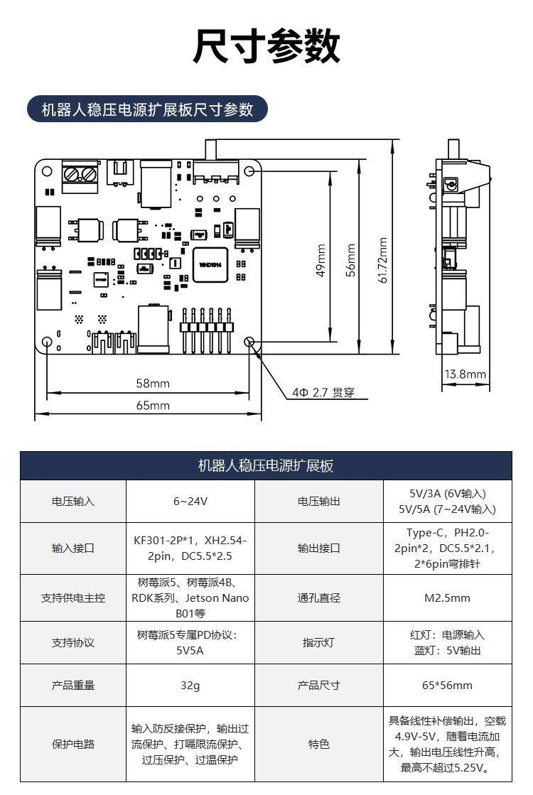

# 机器人稳压电源扩展板

## 识别与资料边界

| 项目 | 结论 |
|---|---|
| 板卡名称 | 机器人稳压电源扩展板 |
| PCB 丝印 | `YAHBOOM YB-MPP01-V1.0` |
| 实物数量 | 待确认；现有资料为商品图片，不能据此推断实际到货数量或配件 |
| 资料状态 | 没有原理图、BOM、芯片型号、连续满载测试或温升测试资料 |
| 可信边界 | 下列参数均为厂商图片标称；机械设计、线束选型和正式供电前应以实物测量与带载测试复核 |

这是一块把 `6–24 V` 直流输入转换为多种 5 V 接口输出的非隔离降压供电板，面向树莓派、Jetson Nano、RDK 系列等单板机及其 5 V 外设。

## 核心规格

| 项目 | 厂商图片标称 | 来源 |
|---|---|---|
| 输入电压 | DC `6–24 V` | 原始图 `photo_4`、`photo_5` |
| 输出电压 | 5 V；空载约 4.9–5.0 V，随电流增加最高不超过 5.25 V | 原始图 `photo_4` |
| 输出电流 | 6 V 输入时 5 V/3 A；7–24 V 输入时 5 V/5 A | 原始图 `photo_4`、`photo_7` |
| 输入接口 | KF301-2P 螺丝端子（5.08 mm 间距）、XH2.54-2P、DC 5.5 × 2.5 | 原始图 `photo_4`、`photo_5` |
| 输出接口 | USB Type-C、PH2.0-2P ×2、DC 5.5 × 2.1、2 × 6 弯排针 | 原始图 `photo_4`、`photo_5` |
| 指示灯 | 红灯：电源输入；蓝灯：5 V 输出 | 原始图 `photo_4`、`photo_5` |
| 保护 | 输入反接、输出过流、打嗝限流、过压、过温 | 原始图 `photo_4` |
| 重量 | 32 g | 原始图 `photo_4` |
| 板上电解电容 | 左侧两颗绿色 **68 µF**，右侧一颗 **470 µF** | 用户对照实物读出丝印 |

> 电容值用于计算上游供电的开机浪涌：若把三颗都保守地算在输入侧，
> 该板贡献约 **606 µF** 的下游电容。

`5 V/5 A` 是图片标称的输出能力，不等同于所有接口、线束、输入电源和散热条件下都可持续输出 25 W。先按目标输入电压、负载组合和安装方式完成温升与压降测试。

## 接口与接线

### 输入端

三种输入接口表达的是三种接线方式。图片没有说明它们可安全并联，因此一次只接入一路电源，不要把多个输入端同时接到不同电源。

| 接口 | 规格 | 使用要点 |
|---|---|---|
| KF301-2P | 5.08 mm 间距螺丝端子，`+` / `-` | 适合剥线后直接压接；上电前核对极性 |
| XH2.54-2P | 2 针插座，`+` / `-` | 用配套线束时仍须检查插头方向与红黑线定义 |
| DC 输入座 | 5.5 × 2.5 mm | 仅作输入；不要与输出侧 5.5 × 2.1 mm 插座混用 |

### 输出端

| 接口 | 规格 | 用途与限制 |
|---|---|---|
| USB Type-C | 5 V 输出 | 图片说明需要兼容 PD 协议的数据线，否则 Type-C 端口可能无电压输出；不要用普通万用表表笔直接探测 Type-C 触点 |
| PH2.0-2P | 2 路 5 V 输出 | 接入前用万用表确认线束极性，不要反向灌电 |
| DC 输出座 | 5.5 × 2.1 mm | 5 V 输出；与输入 DC 规格不同 |
| 2 × 6 弯排针 | 标注 5 V / GND | 适合与主板叠装或短线连接；使用前依据板上丝印逐针确认 |

板顶部有总开关。红色输入指示灯亮起只表示输入侧有电；蓝色 5 V 指示灯才表示 5 V 输出侧已工作。

## 树莓派 5 供电协议

厂商图片称该板支持树莓派 5 的专属 5 V/5 A 供电协议。按图片说明，树莓派 5 识别到该协议后，外接 USB 的电流限额可提升至 1.6 A；未识别专属协议时标称限额为 0.6 A。

这项能力属于主板与供电端的协商结果，不能只凭空载的 5 V 电压判断。首次用于树莓派 5 时，应观察系统欠压告警，并在 USB 外设实际工作时测量输入电流、5 V 电压和板卡温度。

## 机械尺寸与安装

| 项目 | 图片标注 |
|---|---|
| PCB 外形 | 65 × 56 mm |
| 标称最高高度 | 13.8 mm |
| 安装孔 | 4 × Ø2.7 mm 通孔 |
| 推荐螺钉 | M2.5 |
| 图示局部尺寸 | 横向 58 mm，竖向 49 mm / 61.72 mm |

四个安装孔适用 M2.5 螺钉；螺钉不得过长，避免接触背面铜箔或元件而短路。安装面应绝缘，不能直接放在导电金属板上。

## 上电与验收

1. 断电状态下，只选择一个输入接口接入电源，确认极性和输入电压处于 `6–24 V`。
2. 不接负载上电，确认红色输入灯与蓝色 5 V 灯状态正常。
3. 用适合的转接线或 PD 测试仪确认各输出接口的 5 V 电压；不要向任一输出接口反向输入电压。
4. 先接低功率负载，再逐步增加到目标负载；同时监测输出电压、输入线束压降、端子温度和板上温度。
5. 若使用树莓派 5，带 USB 外设进行实际负载测试，确认没有欠压告警、掉盘或重启。

禁止接入超过 24 V 的输入。商品图片还明确禁止在输出端接入输入电压；反接、短路、超压和在导电表面裸放都可能损坏板卡。

## 兼容性与可选附件

图片宣传的兼容对象包括树莓派 5、树莓派 4B、RDK 系列与 Jetson Nano B01 等。这些为厂商图片中的适配主张，不代表所有叠装高度、孔位或线束都已验证。

原始资料还展示了一块可选“双 Type-C 供电转接板”，标称 26 × 10 mm、2 g，长槽中心距 17.6 mm、厚向外廓最高 13.6 mm。该配件是否实际随本板到货，需以实物清点为准。

## 图片收束与来源

最终只保留以下两张工程价值无法可靠文字化的图片：

- `../mechanical/pcb-65x56mm.jpg`：板框、孔位、孔径和高度。
- `../images/robot-power-board-connectors-and-functions.jpg`：各输入/输出接口、开关、指示灯与禁止反向供电说明。

其余原图的信息已转录到本文：

| 原始图 | 已转录内容 |
|---|---|
| `photo_1` | 安全事项与 Type-C 测量限制 |
| `photo_2` | 包装与可选配件类型 |
| `photo_3` | 双 Type-C 转接板尺寸 |
| `photo_6`、`photo_9`、`photo_11`、`photo_12` | 定位、兼容对象与功能概述 |
| `photo_7` | 输入电压与输出电流关系 |
| `photo_8` | 三种输入接线示例 |
| `photo_10` | 树莓派 5 供电协议与 USB 电流限额说明 |

本档案的全部技术结论均来自用户提供的 12 张商品资料图；原始图片在提交 `e21a7b3`（`archive: snapshot raw robot power expansion board materials`）中可回溯。未引入未经归档的外部资料，也不把商品宣传图当作替代原理图或实测报告。
