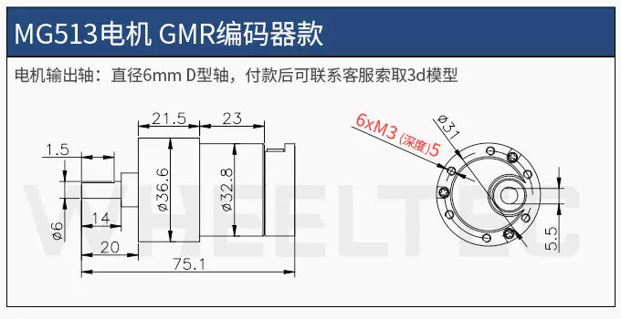
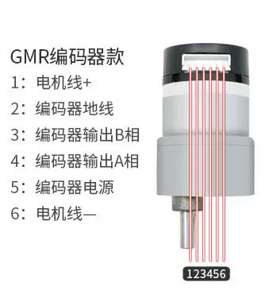
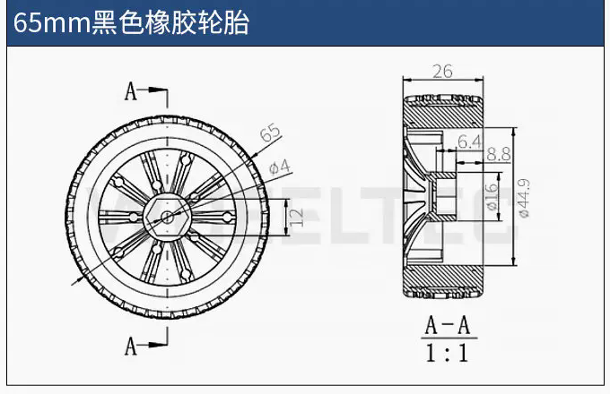
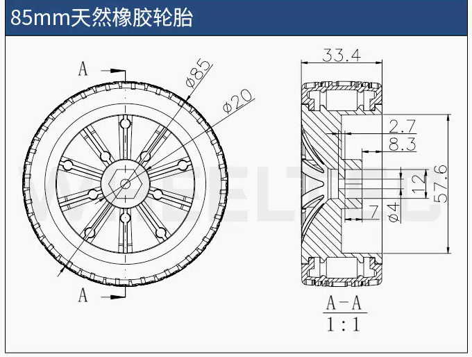
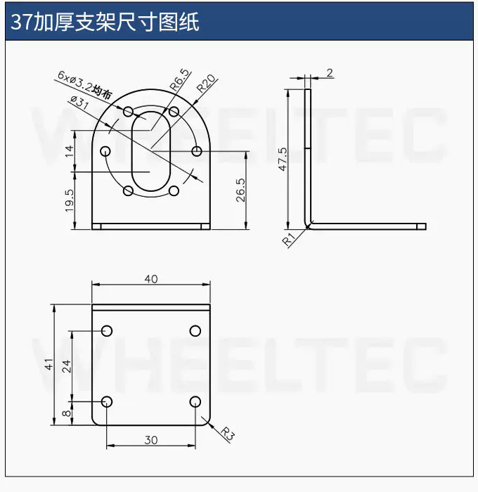

# MG513 GMR 编码器电机组件

本文只整理实际拥有的 GMR 编码器、1:30、12 V 电机及其配套机械件。

## 实际拥有的组件

| 部件 | 型号或规格 | 数量 |
|---|---|---:|
| 直流减速电机 | MG513P30_12V，GMR 编码器，1:30 | 2 |
| 直角支架 | 37 加厚支架 | 2 |
| 主用轮胎 | 65 mm 黑色橡胶轮胎 | 2 |
| 替换轮胎 | 85 mm 天然橡胶轮胎 | 2 |
| 轮轴连接件 | 6 mm 孔径抱紧式六角法兰联轴器 | 数量待确认 |

## 电机参数

| 项目 | MG513P30_12V |
|---|---|
| 电机类型 | 有刷直流减速电机，全金属齿轮箱 |
| 额定电压 | 12 V |
| 建议供电范围 | 11–16 V，12 V 最佳 |
| 减速比 | 1:30 |
| 额定电流 | 0.36 A |
| 堵转电流 | 3.2 A |
| 减速后空载转速 | 366 ± 26 rpm |
| 减速后额定转速 | 293 ± 21 rpm |
| 额定扭矩 | 1 kg·cm |
| 堵转扭矩 | 4.5 kg·cm |
| 功率 | 约 4 W |

堵转电流是驱动器和电源选型的重要边界，不能按额定电流 0.36 A 选择电源或保护器件。

## 机械尺寸

- 总长标注 75.1 mm。
- 输出轴为 Ø6 mm D 形轴，伸出长度标注 20 mm，扁位长度标注 14 mm。
- 电机主体直径约 Ø36.6 mm，后段直径约 Ø32.8 mm。
- 前端安装孔为 6×M3，深度 5 mm，分布圆标注 Ø31 mm。

## GMR 编码器

| 项目 | 参数 |
|---|---|
| 原理 | 巨磁阻效应（GMR） |
| 分辨率 | 500 ppr |
| 供电 | 3.3–5 V |
| 输出 | A/B 两相；带上拉输出，默认上拉到编码器 VCC |
| 接口 | XH2.54 6P |

| 引脚 | 定义 |
|---:|---|
| 1 | 电机正极 |
| 2 | 编码器地 |
| 3 | 编码器 B 相输出 |
| 4 | 编码器 A 相输出 |
| 5 | 编码器电源 |
| 6 | 电机负极 |

商品说明建议配合带硬件编码器接口的 STM32 等控制器使用。正式接线前仍应对照实物插头方向确认 1 脚位置。

## 65 mm 主用轮胎

- 外径 65 mm。
- 宽度 26 mm。
- 商品图片给出的轮胎重量为 32 g。
- 海绵内胎、软橡胶外胎。

## 替换轮胎

外径 Ø85 mm、宽度 33.4 mm、重量 98 g，作为 65 mm 主用轮胎的替换轮。

## 37 加厚直角支架

| 项目 | 参数 |
|---|---|
| 材质 | 钢制，烤漆表面 |
| 厚度 | 2 mm |
| 重量 | 43.6 g |
| 底板 | 40 × 41 mm |
| 立板总高 | 47.5 mm |
| 底板孔中心距 | 30 × 24 mm |

## 六角法兰联轴器

- 抱紧式六角联轴器，孔径 6 mm。
- 用于连接 MG513 的 6 mm D 形输出轴与 65/85 mm 轮胎。
- 当前图片没有独立的联轴器尺寸图；安装前需实测轮侧六角尺寸、有效插入深度和紧固螺钉规格。

## 资料目录

- `../mechanical/mg513-gmr-mechanical-dimensions.png`：GMR 电机机械尺寸。
- `../images/mg513-gmr-pinout.png`：GMR 编码器六针定义。
- `../mechanical/65mm-wheel-dimensions.png`：65 mm 主用轮尺寸。
- `../mechanical/85mm-wheel-dimensions.png`：85 mm 替换轮尺寸。
- `../mechanical/37mm-right-angle-bracket-dimensions.png`：直角支架尺寸。
